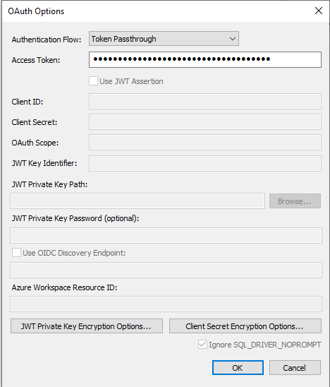
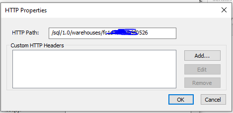

# Source Connector for Databricks

This guide describes how to configure *digna* to connect to Databricks over **ODBC**, using a
**DSN-less** connection string.

The *digna* side of the setup is the same for every technology — where connections are created,
how property values are encrypted, how a connection is tested and what the profiling modes
mean. It is described in [Database Connections Overview](overview.md). This page covers what is
specific to Databricks.

!!! note "Unity Catalog is required"

    *digna* reads the available catalogs from `system.information_schema.catalogs`, so the
    workspace must be Unity Catalog enabled. Earlier *digna* releases offered a separate
    "Databricks Legacy" technology for workspaces without Unity Catalog; it is no longer
    available.

---

## 1. Install the ODBC Driver

Install the **Databricks ODBC Driver** on the machine that runs the *digna* backend, following
[Databricks' installation guide](https://docs.databricks.com/aws/en/integrations/odbc/).

Depending on the version, the driver registers itself as **Simba Spark ODBC Driver** or as
**Databricks ODBC Driver**. Read the exact registered name off your host as described in
[Install the ODBC Driver on the digna Host](overview.md#install-the-driver).

---

## 2. Gather the Connection Details

All values come from the SQL warehouse (or cluster) you want *digna* to use. Open it in the
Databricks workspace and go to **Connection details**:

| Databricks field | Used as |
|---|---|
| **Server hostname** | `Host` |
| **Port** | `Port`, normally `443` |
| **HTTP path** | `HTTPPath` |

For authentication, create a **personal access token** — see
[Databricks personal access token authentication](https://docs.databricks.com/aws/en/dev-tools/auth/pat).
Tokens belong to a user or service principal, and that principal needs `USE CATALOG`,
`USE SCHEMA` and `SELECT` on the source data.

---

## 3. ODBC Properties

Add the following properties in the **Add DB Connection** screen:

| Key | Example value | Notes |
|---|---|---|
| `Driver` | `Simba Spark ODBC Driver` | Must match the driver name registered on the *digna* host |
| `Host` | `<workspace>.cloud.databricks.com` | Server hostname of the warehouse, e.g. `adb-1234567890123456.12.azuredatabricks.net` |
| `Port` | `443` | |
| `HTTPPath` | `/sql/1.0/warehouses/<warehouse-id>` | HTTP path of the warehouse or cluster |
| `SSL` | `1` | Databricks endpoints are TLS-only |
| `ThriftTransport` | `2` | HTTP transport, which is what the SQL endpoints speak |
| `AuthMech` | `3` | Token authentication |
| `UID` | `token` | The literal word `token`, not a user name |
| `PWD` | `dapi…` | The personal access token. Tick **Encrypted** |
| `UseNativeQuery` | `1` | Passes *digna*'s SQL through unchanged — see below |

The resulting connection string looks like this:

```
Driver=Simba Spark ODBC Driver;Host=<workspace>.cloud.databricks.com;Port=443;HTTPPath=/sql/1.0/warehouses/<warehouse-id>;SSL=1;ThriftTransport=2;AuthMech=3;UID=token;PWD=dapi…;UseNativeQuery=1
```

!!! important "Keep `UseNativeQuery=1`"

    With `UseNativeQuery=0` — the driver's default — the driver rewrites incoming SQL into what
    it believes is portable ODBC syntax. *digna* already generates Databricks SQL, so the
    rewrite can change backtick quoting and date literals, and profiling then fails on
    statements that are valid as written.

### OAuth instead of a token

For a service principal with OAuth machine-to-machine authentication, replace `AuthMech`,
`UID` and `PWD` with:

| Key | Example value | Notes |
|---|---|---|
| `AuthMech` | `11` | OAuth |
| `Auth_Flow` | `1` | Client credentials |
| `Auth_Client_ID` | `<application id>` | Service principal |
| `Auth_Client_Secret` | `<client secret>` | Tick **Encrypted** |

---

## 4. *digna* Configuration

In the **Add DB Connection** screen, provide the following:

```
Name:               Name of the connection. This is used for referencing the connection in other screens.
Technology:         Databricks
Profiling Mode:     Standard, Permanent or Session
Work Schema:        Schema for the work tables of "Permanent" profiling, e.g. "digna_work"
```

---

## 5. Notes on Databricks

- **The warehouse must be running**, or able to start, when *digna* connects. A warehouse that
  resumes from a stopped state can take longer than the connection timeout — if the test fails
  on the first attempt after an idle period, retry it.
- **Catalogs come from the workspace.** Unlike most technologies, one Databricks connection
  reaches every catalog the principal is allowed to see, so a single connection can serve
  sources across catalogs.
- **Profiling modes.** *Permanent* creates the work tables in **Work Schema** inside the
  source's catalog, so the principal needs `CREATE TABLE` there. *Session* uses
  `CREATE TEMPORARY TABLE` and does not touch **Work Schema**. *Standard* needs read access
  only.
- **Serverless warehouses work** the same way; only `HTTPPath` differs.

---

## 6. Verifying the Driver (optional)

Configuring an ODBC data source is not required for a DSN-less connection, but the driver's
own dialog is a convenient way to confirm that the driver, the warehouse and the token work
before you enter them in *digna*.

#### Step 1


#### Step 2


#### Step 3


#### Step 4


#### Step 5 – Test the connection

Click the **TEST** button. A successful connection should look like this:


The host, HTTP path and token entered here are exactly the values the properties in
[section 3](#3-odbc-properties) take.