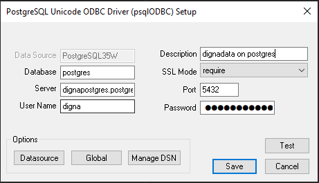

# Source Connector for PostgreSQL

This guide describes how to configure *digna* to connect to PostgreSQL over **ODBC**, using a
**DSN-less** connection string.

The *digna* side of the setup is the same for every technology — where connections are created,
how property values are encrypted, how a connection is tested and what the profiling modes
mean. It is described in [Database Connections Overview](overview.md). This page covers what is
specific to PostgreSQL.

---

## 1. Install the ODBC Driver

Install the PostgreSQL ODBC driver (**psqlODBC**) on the machine that runs the *digna* backend,
following the vendor's official installation guide.

The driver registers itself under a name that differs per platform and package — commonly
**PostgreSQL Unicode(x64)** on Windows and **PostgreSQL ODBC Driver(UNICODE)** on Linux. Read
the exact name off your host as described in
[Install the ODBC Driver on the digna Host](overview.md#install-the-driver), and use that name
for the `DRIVER` property below.

---

## 2. ODBC Properties

Add the following properties in the **Add DB Connection** screen:

| Key | Example value | Notes |
|---|---|---|
| `DRIVER` | `PostgreSQL ODBC Driver(UNICODE)` | Must match the driver name registered on the *digna* host |
| `SERVER` | `db.example.com` | Server name or IP address |
| `PORT` | `5432` | |
| `DATABASE` | `digna_source_db` | Database that holds the source schemas. It is the only database this connection can profile |
| `UID` | `digna_source_user` | Database user |
| `PWD` | `<password>` | Tick **Encrypted** |
| `SSLMode` | `prefer` | `disable`, `allow`, `prefer`, `require`, `verify-ca` or `verify-full` — must be accepted by the server |

The resulting connection string looks like this:

```
DRIVER=PostgreSQL ODBC Driver(UNICODE);SERVER=db.example.com;PORT=5432;DATABASE=digna_source_db;UID=digna_source_user;PWD=<password>;SSLMode=prefer
```

Any further psqlODBC option can be added as an additional property — for example
`ReadOnly=1` for a read-only session, or `ConnSettings` to run `SET` statements at connect
time.

---

## 3. *digna* Configuration

In the **Add DB Connection** screen, provide the following:

```
Name:               Name of the connection. This is used for referencing the connection in other screens.
Technology:         Postgres
Profiling Mode:     Standard, Permanent or Session
Work Schema:        Schema for the work tables of "Permanent" profiling, e.g. "digna_work"
```

---

## 4. Notes on PostgreSQL

- **`SSLMode` must match the server.** A server configured with `hostssl` rejects
  `SSLMode=disable`, and `verify-ca` or `verify-full` additionally need the root certificate to
  be available to the driver on the *digna* host. If you had to choose a specific mode when
  testing the driver, use the same one here.
- **One connection sees one database.** *digna* offers the schemas of the database named in
  `DATABASE`, because PostgreSQL reports only the current database as a catalog. Source tables
  in another database need their own connection.
- **Profiling modes.** *Permanent* creates the work tables in **Work Schema**, so the user
  needs `CREATE` on that schema. *Session* uses `CREATE TEMPORARY TABLE` and does not touch
  **Work Schema**. *Standard* needs read access only.

---

## 5. Verifying the Driver (optional)

Configuring an ODBC data source is not required for a DSN-less connection, but the driver's
own dialog is a convenient way to confirm that the driver works and that the server accepts
your credentials and SSL mode before you enter them in *digna*.

#### Step 1


#### Step 2 – Test the connection

Click the **Test Connection** button.


The values you entered here are exactly the values the properties in
[section 2](#2-odbc-properties) take.