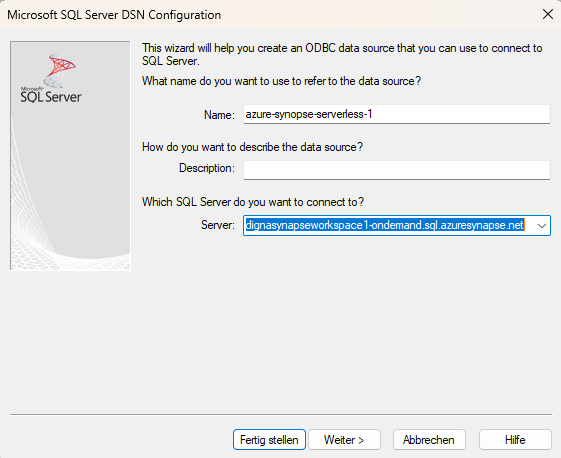
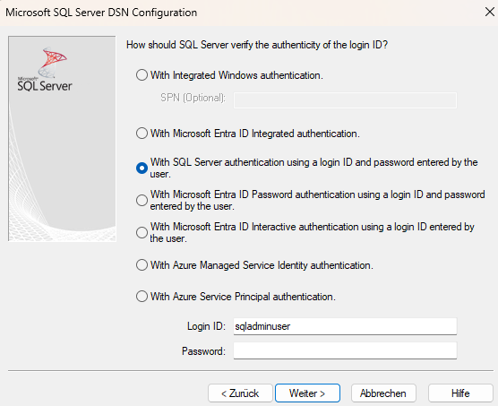
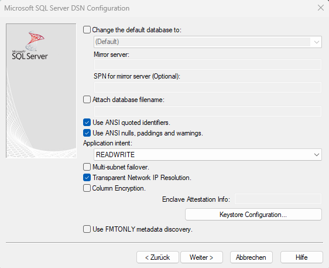
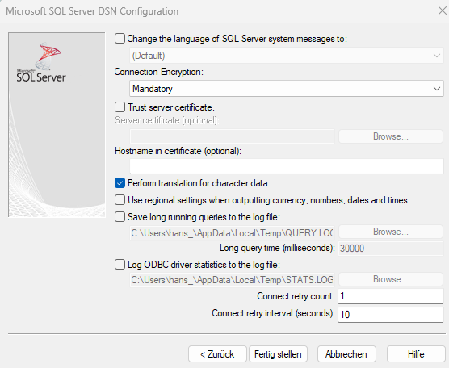
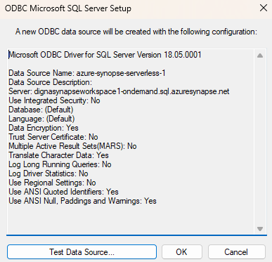
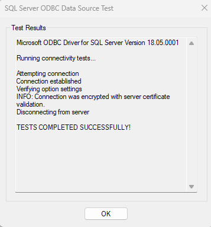

# Source Connector for Azure Synapse Analytics

This guide describes how to configure *digna* to connect to Azure Synapse Analytics using either the native Python connector or the ODBC driver.
It supports both serverless and dedicated SQL pools.

This configuration refers to the screen  **"INTEGRATIONS" &rarr;  "DB CONNECTIONS" &rarr; "+ ADD DB CONNECTION"**.


---

## Native Python Driver

**Library:** `pymssql`  
**Supported Authentication:** Password-based authentication only

> For other authentication methods, please use the ODBC driver.

### *digna* Configuration (Native Driver)

Provide the following information in the **"Create Database Connection"** screen:

```
Name:               Name of the connection. This is used for referencing the connection in other screens.
Technology:         MS SQL Server
Host Address:       <synapse-workspace>[-ondemand].sql.azuresynapse.net
Host Port:          Port number, e.g. 1433
Database Name:      Database name
User Name:          Database user name
User Password:      Password for the user
Profiling Mode:     The profiling mode determines how digna processes data and calculates metrics:
                    - Standard: Metrics are calculated directly on the source tables without copying the data.
                    - Permanent: Data for the inspected day is copied into a permanent table, and metrics are calculated on the copied data.
                    - Session: Data is copied into a session or temporary table, and metrics are calculated on this temporary data.
                    For serverless SQL pool, only "Standard" is supported.
Work Schema Name:   When using "Permanent" profiling mode, work tables will be placed in this schema.
Use ODBC:           Disabled (default)
```

---

## ODBC Driver

The ODBC driver may support a broader range of authentication and connectivity options. This section focuses on password-based authentication using the driver **ODBC Driver 18 for SQL Server**.

### 1. Install the ODBC Driver

Install the driver **ODBC Driver 18 for SQL Server** (or similar) by following the vendor’s official installation guide.

### 2. Configure the ODBC Data Source

Follow these steps to configure a new ODBC data source using password-based authentication:

#### Step 1


Fill out the "Server" field.
Use the name of the synapse workspace and extend it with ".sql.azuresynapse.net.   
**Attention**, if you want to connect using a serverless SQL pool, make sure to include "-ondemand" as shown in below screenshot.

Click the **Next >** button.

#### Step 2


Choose the authentication method (e.g. username and password)
and provide the required data.

Click the **Next >** button.

#### Step 3


Choose the ANSI compliant settings then click the **Next >** button.

#### Step 4


You can leave the default settings or choose options as needed 
and click the **Finish** button. 

#### Step 5


Now click the **Test datasource** button.

#### Step 6


When you receive the success screen, ODBC is configured properly.

---

Now you can configure *digna* to use the ODBC connection, either with a **DSN (Data Source Name)** or a **DSN-less** setup.

---

### A. DSN-Based Configuration

#### *digna* Configuration

In the **"Create Database Connection"** screen, provide the following:

```
Name:               Name of the connection. This is used for referencing the connection in other screens.
Technology:         MS SQL Server
Database Name:      Database that contains the source schemata
Profiling Mode:     The profiling mode determines how digna processes data and calculates metrics:
                    - Standard: Metrics are calculated directly on the source tables without copying the data.
                    - Permanent: Data for the inspected day is copied into a permanent table, and metrics are calculated on the copied data.
                    - Session: Data is copied into a session or temporary table, and metrics are calculated on this temporary data.
                    For serverless SQL pool, only "Standard" is supported.
Work Schema Name:   When using "Permanent" profiling mode, work tables will be placed in this schema.
Use ODBC:           Enabled
```

#### ODBC Properties

```
name: "DSN",        value: "azure-synopse-serverless-1"
name: "UID",        value: "your database user"
name: "PWD",        value: "your database password"
name: "DATABASE",   value: "name of the database that contains the source data schema"

```

> The `DSN` must match the name defined in your ODBC driver configuration.

---

### B. DSN-less Configuration

#### *digna* Configuration

In the **"Create a Database Connection"** screen, provide the following:

```
Name:               Name of the connection. This is used for referencing the connection in other screens.
Technology:         MS SQL Server
Database Name:      Name of the database that contains the source data schema
Profiling Mode:     The profiling mode determines how digna processes data and calculates metrics:
                    - Standard: Metrics are calculated directly on the source tables without copying the data.
                    - Permanent: Data for the inspected day is copied into a permanent table, and metrics are calculated on the copied data.
                    - Session: Data is copied into a session or temporary table, and metrics are calculated on this temporary data.
                    For serverless SQL pool, only "Standard" is supported.
Work Schema Name:   When using "Permanent" profiling mode, work tables will be placed in this schema.
Use ODBC:           Enabled
```

#### ODBC Properties

```
name: "DRIVER",     value: "ODBC Driver 18 for SQL Server"
name: "SERVER",     value: "<synapse-workspace>[-ondemand].sql.azuresynapse.net"
name: "UID",        value: "your database user"
name: "PWD",        value: "your database password"
name: "DATABASE",   value: "name of the database that contains the source data schemata"
```

**Note** regarding the SERVER property:  
Use the name of the synapse workspace and extend it with ".sql.azuresynapse.net. If you want to connect using a serverless SQL pool, make sure to include "-ondemand" as shown in below screenshot.
