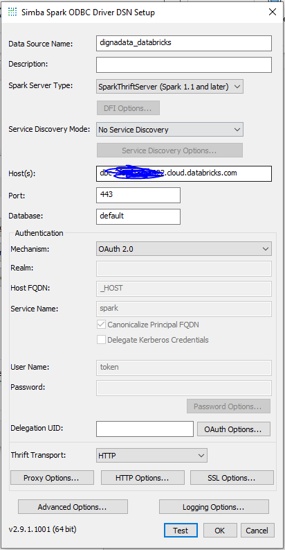
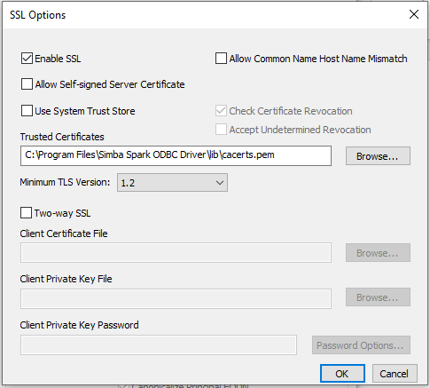
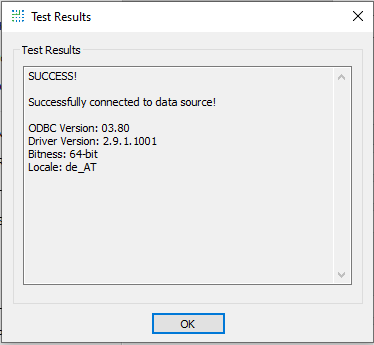

# Source Connector for Databricks - with Unity Catalog

This guide describes how to configure *digna* to connect to Databricks using either the native Python connector or the ODBC driver.

It refers to the screen **"Create a Database Connection"**.


---

## Native Python Driver

**Library:** `databricks-sql-connector`  
**Supported Authentication:** Personal Access Token (PAT) only

> For other authentication methods, please use the ODBC driver.

### Personal Access Token (PAT)

To authenticate using a personal access token, refer to the official Databricks documentation:  
[How to obtain a PAT](https://docs.databricks.com/aws/en/dev-tools/auth/pat)

### *digna* Configuration (Native Driver)

Provide the following information in the **"Create a Database Connection"** screen:

```
Name:               Name of the connection. This is used for referencing the connection in other screens.
Technology:         Databricks
Host Address:       Databricks hostname, e.g. "xxxxxxxxxxxxxxxxxxx.databricks.com"
Host Port:          e.g. 443
Database Name:      Name of the catalog to use. 
User Name:          HTTP Path provided by Databricks, e.g. "/sql/1.0/warehouses/xxxxxxxxxxxxxxx"
User Password:      Personal Access Token, e.g. "dapixxxxxxxxxxxxxxxxxxxxxxxxxxxxxxxx"
Profiling Mode:     The profiling mode determines how digna processes data and calculates metrics:
                    - Standard: Metrics are calculated directly on the source tables without copying the data.
                    - Permanent: Data for the inspected day is copied into a permanent table, and metrics are calculated on the copied data.
                    - Session: Data is copied into a session or temporary table, and metrics are calculated on this temporary data.
Work Schema Name:   When using "Permanent" profiling mode, work tables will be placed in this schema.
Use ODBC:           Disabled (default)
```

---

## ODBC Driver

The ODBC driver supports a broader range of authentication and connectivity options. This section focuses on token-based authentication using the **Simba Spark ODBC Driver**.

### 1. Install the ODBC Driver

Install the **Simba Spark ODBC Driver** by following the vendor’s official installation guide.

### 2. Configure the ODBC Data Source

Follow these steps to configure a new ODBC data source using a Personal Access Token:

#### Step 1


#### Step 2


#### Step 3


#### Step 4


#### Step 5 – Test the connection

Click the **TEST** button. A successful connection should look like this:



---

Now you can configure *digna* to use the ODBC connection, either with a **DSN (Data Source Name)** or a **DSN-less** setup.

---

### A. DSN-Based Configuration

#### *digna* Configuration

In the **"Create a Database Connection"** screen, provide the following:

```
Name:               Name of the connection. This is used for referencing the connection in other screens.
Technology:         Databricks
Database Name:      Name of the catalog to use.
Profiling Mode:     The profiling mode determines how digna processes data and calculates metrics:
                    - Standard: Metrics are calculated directly on the source tables without copying the data.
                    - Permanent: Data for the inspected day is copied into a permanent table, and metrics are calculated on the copied data.
                    - Session: Data is copied into a session or temporary table, and metrics are calculated on this temporary data.
Work Schema Name:   When using "Permanent" profiling mode, work tables will be placed in this schema.
Use ODBC:           Enabled
```

#### ODBC Properties

```
name: "DSN",    value: "*digna*data_databricks"
```

> The `DSN` must match the name defined in your ODBC driver configuration.

---

### B. DSN-less Configuration

#### *digna* Configuration

In the **"Create a Database Connection"** screen, provide the following:

```
Name:               Name of the connection. This is used for referencing the connection in other screens.
Technology:         Databricks
Database Name:      Name of the catalog to use.
Profiling Mode:     The profiling mode determines how digna processes data and calculates metrics:
                    - Standard: Metrics are calculated directly on the source tables without copying the data.
                    - Permanent: Data for the inspected day is copied into a permanent table, and metrics are calculated on the copied data.
                    - Session: Data is copied into a session or temporary table, and metrics are calculated on this temporary data.
Work Schema Name:   When using "Permanent" profiling mode, work tables will be placed in this schema.
Use ODBC:           Enabled
```

#### ODBC Properties

```
name = "Driver",          value = "{Simba Spark ODBC Driver}"
name = "Host",            value = "xxxxxxxxxxxxxxxxxxx.databricks.com"
name = "Port",            value = "443"
name = "HTTPPath",        value = "/sql/1.0/warehouses/xxxxxxxxxxxxxxx"
name = "SSL",             value = "1"
name = "ThriftTransport", value = "2"
name = "AuthMech",        value = "3"
name = "UID",             value = "token"
name = "PWD",             value = "dapixxxxxxxxxxxxxxxxxxxxxxxxxxxxxxxx"
```
