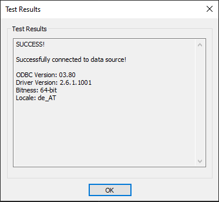

# Source Connector for Hive

This guide describes how to configure *digna* to connect to Apache Hive over **ODBC**, using a
**DSN-less** connection string.

The *digna* side of the setup is the same for every technology — where connections are created,
how property values are encrypted, how a connection is tested and what the profiling modes
mean. It is described in [Database Connections Overview](overview.md). This page covers what is
specific to Hive.

---

## 1. Install the ODBC Driver

Install the **Cloudera ODBC Driver for Apache Hive** on the machine that runs the *digna*
backend, following the vendor's official installation guide.

Read the exact registered driver name off your host as described in
[Install the ODBC Driver on the digna Host](overview.md#install-the-driver).

---

## 2. ODBC Properties

!!! important "An example, not a specification"

    The set below is one combination that is known to work. The properties belong to the
    Cloudera Hive driver, so their names, defaults and accepted values differ between driver
    versions and platforms, and what HiveServer2 accepts depends entirely on how the cluster is
    secured — authentication mechanism, transport mode, TLS, gateway. Use this as a starting
    point and check the documentation of the driver version you installed.

Add the following properties in the **Add DB Connection** screen:

| Key | Example value | Notes |
|---|---|---|
| `DRIVER` | `Cloudera ODBC Driver for Apache Hive` | Must match the driver name registered on the *digna* host |
| `HOST` | `hive.example.com` | HiveServer2 host name or IP address |
| `PORT` | `10000` | HiveServer2 port; `10001` for HTTP transport |

The resulting connection string looks like this:

```
DRIVER=Cloudera ODBC Driver for Apache Hive;HOST=hive.example.com;PORT=10000
```

### Authentication

An unsecured HiveServer2 accepts the three properties above as they are. Where authentication
is enabled, add:

| Key | Example value | Notes |
|---|---|---|
| `AuthMech` | `3` | `0` no authentication, `2` user name only, `3` user name and password, `1` Kerberos |
| `UID` | `digna_source_user` | Required for `AuthMech` `2` and `3` |
| `PWD` | `<password>` | Required for `AuthMech` `3`. Tick **Encrypted** |

For Kerberos (`AuthMech=1`), the *digna* host additionally needs a valid ticket or keytab, plus
the `KrbHostFQDN`, `KrbServiceName` and `KrbRealm` properties the driver documents.

### Transport and TLS

| Key | Example value | Notes |
|---|---|---|
| `ThriftTransport` | `2` | `0` binary (the default, port 10000), `1` SASL, `2` HTTP (port 10001, and what a Knox gateway expects) |
| `HTTPPath` | `cliservice` | With `ThriftTransport=2` |
| `SSL` | `1` | Where HiveServer2 is TLS-secured |
| `Schema` | `dignadata` | Hive database the session starts in. Optional — *digna* qualifies its queries |

---

## 3. *digna* Configuration

In the **Add DB Connection** screen, provide the following:

```
Name:               Name of the connection. This is used for referencing the connection in other screens.
Technology:         Hive
Profiling Mode:     Standard, Permanent or Session
Work Schema:        Hive database for the work tables of "Permanent" profiling, e.g. "digna_work"
```

---

## 4. Notes on Hive

- **Catalogs come from the driver.** Hive has no catalog of its own, so *digna* takes what the
  driver reports — normally a single entry named `HIVE` — and lists the Hive databases as
  schemas below it.
- **Work Schema is a Hive database.** For *Permanent* profiling, the user needs the right to
  create and drop tables in it, and the underlying storage location must be writable.
- **Profiling modes.** *Permanent* creates the work tables in **Work Schema**. *Session* uses
  `CREATE TEMPORARY TABLE`, which needs a HiveServer2 that supports temporary tables and
  does not touch **Work Schema**. *Standard* needs read access only, and is the mode to choose
  on a cluster where *digna* has no write access at all.
- **Profiling is a set of queries, not a scan.** Every statistic is computed by HiveServer2, so
  the queue *digna*'s user submits to should have enough capacity for the inspection window.

---

## 5. Verifying the Driver (optional)

Configuring an ODBC data source is not required for a DSN-less connection, but the driver's
own dialog is a convenient way to confirm that the driver, the transport mode and your
credentials work before you enter them in *digna*.

#### Step 1


The **Host**, **Port**, **Database**, **Mechanism** and **Thrift Transport** fields here are
the `HOST`, `PORT`, `Schema`, `AuthMech` and `ThriftTransport` properties in
[section 2](#2-odbc-properties).

#### Step 2 – Test the connection

Provide the password and click the **Test** button.



After a successful test, click the **OK** button.
