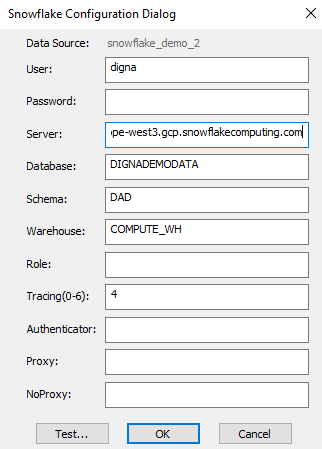
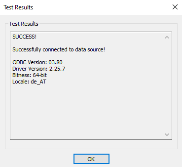

# Source Connector for Snowflake

This guide describes how to configure *digna* to connect to Snowflake using either the native Python connector or the ODBC driver.

It refers to the screen **"Create a Database Connection"**.


---

## Native Python Driver

**Library:** `snowflake-connector-python`  
**Supported Authentication:** Password-based authentication only

> ⚠️ For other authentication methods, please use the ODBC driver.

### *digna* Configuration (Native Driver)

Provide the following information in the **"Create a Database Connection"** screen:

```
Name:               Name of the connection. This is used for referencing the connection in other screens.
Technology:         Snowflake
Host Address:       Snowflake account name
Host Port:          Not needed
Database Name:      Database that contains the source schema
User Name:          User name and warehouse in the format "user<@>warehouse"
User Password:      Password for the user
Profiling Mode:     The profiling mode determines how digna processes data and calculates metrics:
                    - Standard: Metrics are calculated directly on the source tables without copying the data.
                    - Permanent: Data for the inspected day is copied into a permanent table, and metrics are calculated on the copied data.
                    - Session: Data is copied into a session or temporary table, and metrics are calculated on this temporary data.
Work Schema Name:   When using "Permanent" profiling mode, work tables will be placed in this schema.
Use ODBC:           Disabled (default)
```

---

## ODBC Driver

The ODBC driver may support a broader range of authentication and connectivity options. This section focuses on password-based authentication using the **SnowflakeDSIIDriver**.

### 1. Install the ODBC Driver

Install the **SnowflakeDSIIDriver** by following the vendor’s official installation guide.

### 2. Configure the ODBC Data Source

Follow these steps to configure a new ODBC data source using password-based authentication:

#### Step 1


Notes: 
- If you do not provide values for Database, Schema and Warehouse, then you will need to provide them as ODBC properties during the *digna* data source configuration.
- The value for "Server" consists of your snowflake account name followed by ".snowflakecomputing.com"

#### Step 2 – Test the connection

Click the **TEST** button. A successful connection should look like this:



---

Now you can configure *digna* to use the ODBC connection, either with a **DSN (Data Source Name)** or a **DSN-less** setup.

---

### A. DSN-Based Configuration

#### *digna* Configuration

In the **"Create a Database Connection"** screen, provide the following:

```
Name:               Name of the connection. This is used for referencing the connection in other screens.
Technology:         Snowflake
Database Name:      Database that contains the source schemas
Profiling Mode:     The profiling mode determines how digna processes data and calculates metrics:
                    - Standard: Metrics are calculated directly on the source tables without copying the data.
                    - Permanent: Data for the inspected day is copied into a permanent table, and metrics are calculated on the copied data.
                    - Session: Data is copied into a session or temporary table, and metrics are calculated on this temporary data.
Work Schema Name:   When using "Permanent" profiling mode, work tables will be placed in this schema.
Use ODBC:           Enabled
```

#### ODBC Properties

```
name: "DSN",            value: "snowflake_demo_2"
name: "PWD",            value: "{your password in curly braces}"

optionally:
name: "Database",       value: "Database that contains the source schemas"
name: "Warehouse",      value: "Warehouse to use for the execution of the SQLs"
```

> 🔹 The `DSN` must match the name defined in your ODBC driver configuration.

---

### B. DSN-less Configuration

#### *digna* Configuration

In the **"Create a Database Connection"** screen, provide the following:

```
Technology:         Snowflake
Database Name:      Database that contains the source schemas
Profiling Mode:     The profiling mode determines how digna processes data and calculates metrics:
                    - Standard: Metrics are calculated directly on the source tables without copying the data.
                    - Permanent: Data for the inspected day is copied into a permanent table, and metrics are calculated on the copied data.
                    - Session: Data is copied into a session or temporary table, and metrics are calculated on this temporary data.
Work Schema Name:   When using "Permanent" profiling mode, work tables will be placed in this schema.
Use ODBC:           Enabled
```

#### ODBC Properties

```
name: "Driver",     value: "{SnowflakeDSIIDriver}"
name: "Server",     value: "your-account-name.snowflakecomputing.com'
name: "UID",        value: "your snowflake user'
name: "PWD",        value: "your snowflake password"
name: "Database",   value: "Database that contains the source schema"
name: "Warehouse",  value: "Warehouse to use for the execution of the SQLs"
```
